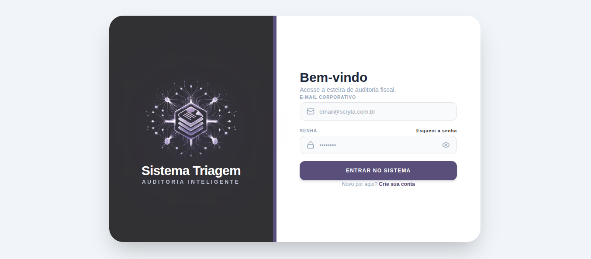
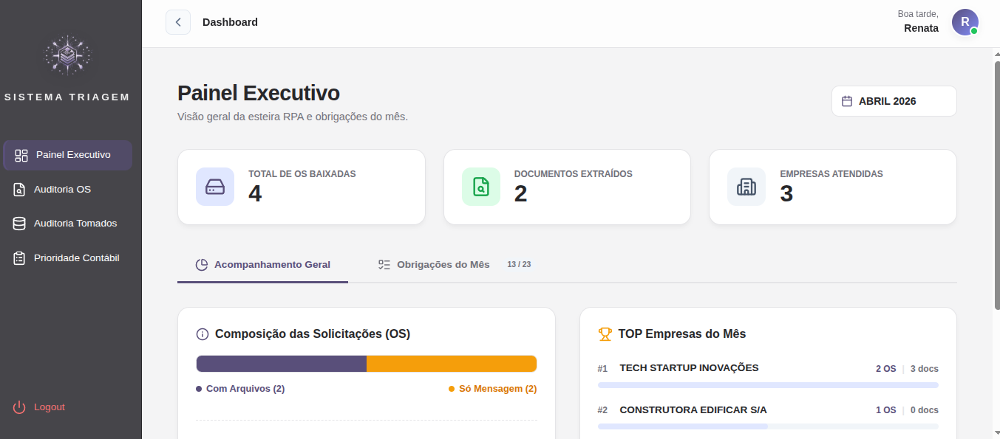
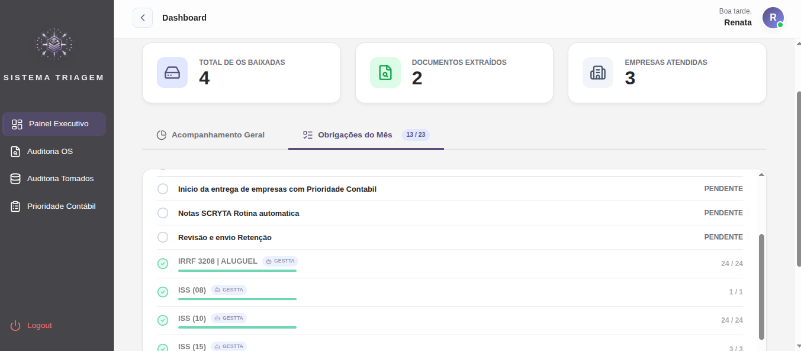
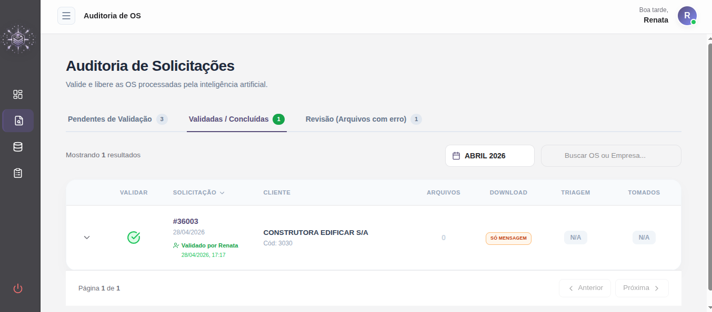
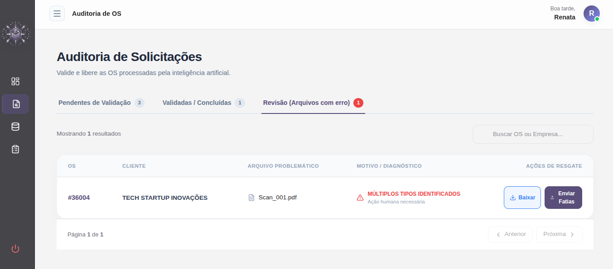
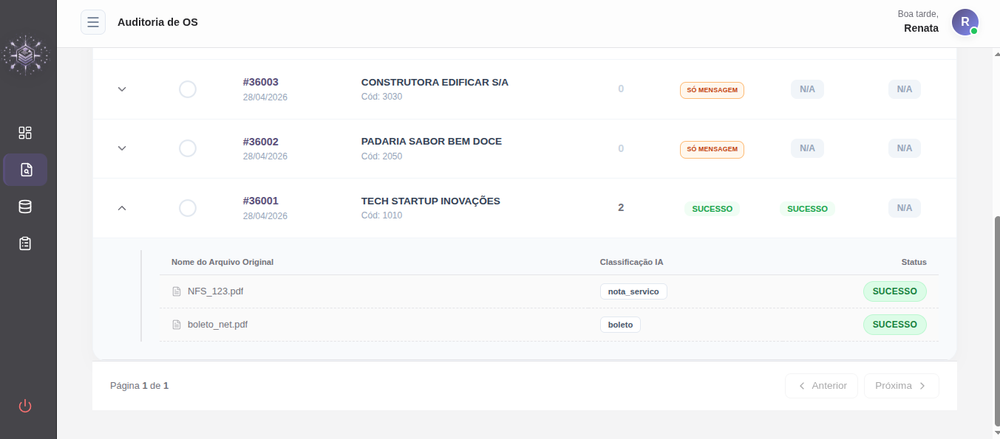
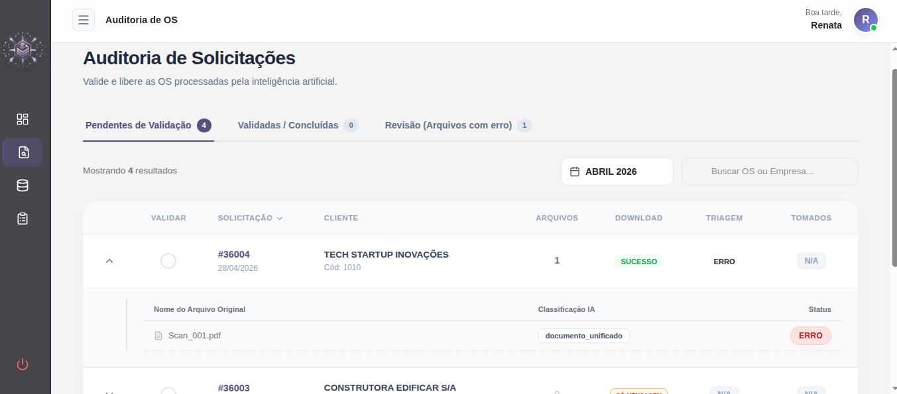
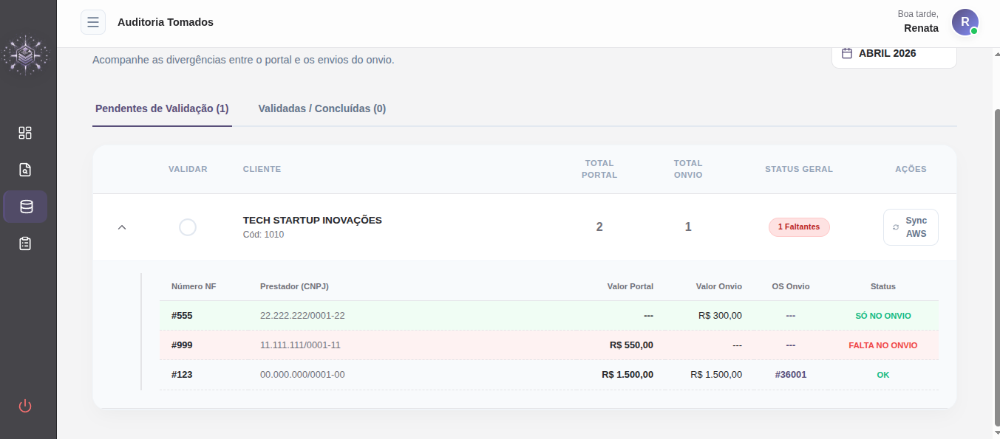
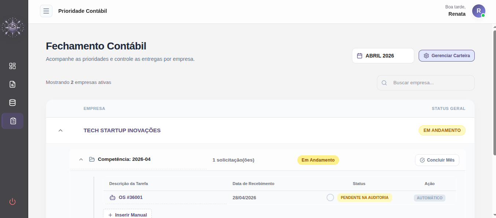

# 🚀 Sistema de Triagem RPA (Refatoração Cloud & IA)

Este projeto é a evolução definitiva e de alto desempenho da arquitetura original [**Projeto_Claud**](https://github.com/Renata5207418/Projeto_Claud). O objetivo é automatizar a esteira completa de documentos fiscais, desde a captura no portal Onvio, passando pela triagem com Inteligência Artificial, até o processamento final de notas e conciliação de malha fiscal — cruzando os dados extraídos pelo robô com os XMLs oficiais das prefeituras, que são capturados e armazenados na nuvem (AWS) por um microsserviço independente (**Busca XML**).

---

## 📸 Visão Geral do Sistema (Interface Web)

O monitoramento completo da esteira RPA é feito através de um SPA desenvolvido em React, consumindo a API FastAPI do orquestrador.

### Login e Dashboard Executivo
Visão macro da esteira com contadores em tempo real. O sistema integra-se nativamente a um microsserviço proprietário de Automação Gestta, que sincroniza e atualiza automaticamente o status das obrigações fiscais do mês, permitindo o acompanhamento do fluxo de trabalho sem sair do painel.

<div align="center">
  
  
</div>
<div align="center">
  
</div>

### Auditoria de OS e Quarentena (Revisão)
Acompanhamento das solicitações processadas com sucesso pela IA e a área de "Revisão", onde arquivos irregulares (ex: documentos unificados incorretamente) aguardam intervenção humana.

<div align="center">
  
  
</div>
<div align="center">
  
  
</div>

### Malha Fiscal e Prioridade Contábil
Conciliação automatizada apontando divergências entre o portal (AWS) e o Onvio, além do controle inteligente de prioridades da carteira contábil.

<div align="center">
  
  
</div>

---

## 🏗️ Evolução e Robustez
Diferente da versão legacy, esta refatoração transforma scripts soltos em processos industriais paralelos coordenados por um orquestrador central, amparados por um banco de dados de resiliência e painel de controle.

### 🛠️ O que mudou? (Upgrade Tecnológico)
| Recurso | Versão Anterior (Legacy) | Nova Versão (Refatorada) |
| :--- | :--- | :--- |
| **Motor de Captura** | Selenium + ChromeDriver (Lento) | **Playwright (Interceptação de API + Headless)** |
| **Classificação** | Regex e Leitura Simples | **IA Generativa (Claude Haiku 3.5)** |
| **Identificação de Arquivos**| Baseada na extensão do arquivo | **Leitura de DNA Binário (Magic Bytes)** |
| **Confiabilidade** | Sensível a erros e interrupções | **Banco SQLite de Persistência (Retries automáticos)** |
| **Ambiente de Monitoramento**| Logs no terminal do sistema | **Dashboard Web Completo (React + FastAPI)** |
| **Malha Fiscal** | Processo 100% manual | **Conciliação Automatizada Triabot vs AWS** |

---

## 📂 Estrutura do Projeto

```text
SISTEMA_TRIAGEM/
├── .venv/                  # Ambiente virtual Python
├── arquivos/               # Destino físico dos arquivos organizados (Empresa/Mês/Ticket)
├── .env                    # Configurações de credenciais e chaves de API
├── banco_rpa.db            # Cérebro do sistema (Status, Logs, Triagem, Malha)
├── requirements.txt        # Bibliotecas necessárias (Backend)
├── orquestrador.py         # Maestro: Roda Download, Triagem e Tomados em paralelo
│
├── download/               # 🤖 MÓDULO 1: Extrator Onvio
│   ├── main.py             # Bypass 2FA, Captura de Token e Loop de Ingestão de Anexos
│   └── __init__.py         
│
├── triagem/                # 🤖 MÓDULO 2: Classificador de Documentos
│   ├── main.py             # Leitura de DNA, Bloqueio de Documentos Mistos e Fatiamento
│   ├── motor_ia.py         # Integração com API Anthropic para taxonomia visual/texto
│   └── __init__.py         
│
├── tomados/                # 🤖 MÓDULO 3: Motor de Tomados (Notas de Serviço)
│   ├── main.py             # Busca no banco e roteamento de extração
│   ├── motor_extracao.py   # Extração inteligente via IA para JSON estruturado
│   └── __init__.py         
│
├── api/                    # ⚙️ BACKEND WEB
│   ├── api.py              # FastAPI (Endpoints de Auditoria, Malha e Prioridades)
│   └── aws_service.py      # Integração via Boto3 para buscar XMLs da nuvem
│
├── frontend/               # 🖥️ FRONTEND WEB
│   ├── package.json        # Dependências React/TypeScript
│   └── src/                # Telas (Quarentena, Checklist, Prioridade Contábil)
│
└── db/                     # 🗄️ CAMADA DE DADOS
    ├── db_dominio.py       # Conexão Sybase/SQL Anywhere (ERP Domínio)
    └── db_resiliencia.py   # ORM em SQLite com timeout handling
```

---

## ⚙️ Destaques Técnicos & Blindagens

* **Download Resiliente e Inteligente:**
  * Interceptação de `UDSLongToken` via Playwright para downloads instantâneos por API.
  * *Fuzzy Matching* (`RapidFuzz`) para cruzar clientes com nomes irregulares do Onvio com o banco oficial da Domínio.
  * Trava de `OS_INICIAL` para transição segura em produção.
  * Efeito "Matrioska": descompactação recursiva de ZIPs e RARs mantendo segurança contra DNA falso de documentos do Office (`.docx` / `.xlsx`).

* **Triagem à Prova de Balas:**
  * **DNA Reader (Magic Bytes):** Ignora extensões renomeadas pelo usuário e lê o cabeçalho binário real do arquivo.
  * **Anti-Lixo do SO:** Ignora nativamente arquivos ocultos (`.DS_Store`, `Thumbs.db`), arquivos de 0 bytes e previne crashes de limite de caracteres truncando nomes enormes.
  * **Fatiador de Documentos Mistos:** Algoritmo pré-IA que analisa o PDF para barrar e fatiar lotes irregulares (ex: Notas Fiscais e Boletos escaneados no mesmo arquivo).

* **Motor de Tomados & Malha Fiscal:**
  * Automação híbrida: salva o texto das notas extraído (`fitz` / PyMuPDF) otimizando o consumo de tokens na IA.
  * Sincronização passiva com a AWS para conciliar Notas de Serviço na tela do analista em tempo real, detectando notas divergentes ou fantasmas.

* **Dashboard Web:**
  * SPA em React listando arquivos em "Quarentena" para o operador arrumar e reenviar.
  * Painel de Prioridade Contábil com *Autocomplete Smart* (busca dupla por código ou nome direto no banco Sybase).
  * Checklist inteligente conectando tarefas manuais a integrações com Gestta.

---

## 🚀 Como Executar

### Pré-requisitos
1. **Python 3.12+**
2. **Node.js 18+** (Para rodar o painel Web)
3. **Driver SQL Anywhere 17** (Para conexão com a Domínio).

### 1. Preparando o Ambiente
```bash
# Clone e ative o ambiente virtual
python -m venv .venv
source .venv/bin/activate  # ou .venv\Scripts\activate no Windows

# Instale as dependências dos robôs e da API
pip install -r requirements.txt

# Baixe os binários do navegador para o Playwright
playwright install chromium
```

### 2. Rodando o Motor RPA (Background)
O orquestrador usa `multiprocessing` para rodar as três filas de forma paralela e independente.
```bash
python orquestrador.py
```

### 3. Subindo o Painel Web (Dashboard)
Em terminais separados, inicie o backend e o frontend:
```bash
# Terminal 1 (Backend - FastAPI):
uvicorn api.api:app --host 0.0.0.0 --port 8000

# Terminal 2 (Frontend - React):
cd frontend
npm install
npm run dev
```

---

## 🛡️ Propriedade Intelectual e Licença

Este software foi desenvolvido com exclusividade e sob medida.
**Copyright (c) 2026 Todos os direitos reservados.**

A propriedade intelectual, código-fonte, arquitetura, prompts de inteligência artificial e binários associados pertencem exclusivamente à desenvolvedora, conforme a Lei de Proteção de Propriedade Intelectual de Programa de Computador (Lei nº 9.609/98). É estritamente vedada a cópia, distribuição, engenharia reversa ou uso não autorizado.
